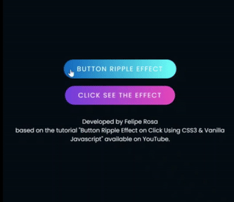

# Buttons on HTML
## 💻 About this project (sobre este projeto)
:us: This project aimed testing and learning HTML, CSS, and JS codes with focus on different types of buttons, based on youtube tutorials.

:brazil: Este projeto teve por objetivo testar e conhecer códigos em HTML, CSS, e JS com foco em diferentes tipos de botões, baseado em tutoriais do youtube.

---
## ⚙️ Project demonstration (demontração do projeto)

- Checkbox with a minimalist style by HTML, and CSS
<p align="center"> 

- Buttons with effects on click by HTML, CSS, and JS
<p align="center"> 
 
- Neon buttons with effects on click by HTML, and CSS
<p align="center"> 
 
- Neuomorphic checkbox-buttons by HTML, and CSS
<p align="center"> 
 
- Calculator by HTML, and CSS
<p align="center"> 
 
- Background color changing on click by HTML, CSS, and JS
<p align="center"> 

- Background color and HEX code changing on click by HTML, CSS, and JS
<p align="center"> 

<p align="center"> 


---
	
## 💡 Knowledge acquired (conhecimentos adquiridos)

- During this project, I learned:
  - integrate CSS and HTML codes;
  - setting definitions on CSS based on input type at the HTML code, considering modifications when some button is or not checked;
  - add event listener, as well as create and remove 'span' element on click;
  - import font from google apis to a CSS code;
  - create the hover effect on the box using CSS;
  - create lines around a box and animate it using CSS;
  - import sources to an HTML code from bootstrap;
  - using onclick to set and calculate values; and
  - setting a random number function on JS, so I could change background colors hex codes randomly.


---

## 🚀 How to execute this project (como executar este projeto)

To execute this project you will only need a browser and the program Visual Studio Code.

### Requirements (requisitos)

Before you begin, you will need to install on your computer the following tool: [VSCode](https://code.visualstudio.com/)

#### 🎲 Running the codes (rodando os códigos)

```bash

# Clone this repository
$ git clone git@github.com:rosadigital/Neon-button.git

# Open the repository on VS Code to run

```

---

## 🦸 Author (autor)


Felipe Rosa on [LinkedIn](https://www.linkedin.com/in/felipe-rosa/)

---

## 📝 License (licença)

This project is licensed under [MIT](./LICENSE).

Este projeto esta sobe a licença [MIT](./LICENSE).

Made with ❤️ by Felipe Rosa 👋🏽 [Contact here!](https://www.linkedin.com/in/felipe-rosa/)

Feito com ❤️ por Felipe Rosa 👋🏽 [Entre em contato!](https://www.linkedin.com/in/felipe-rosa/)

--
